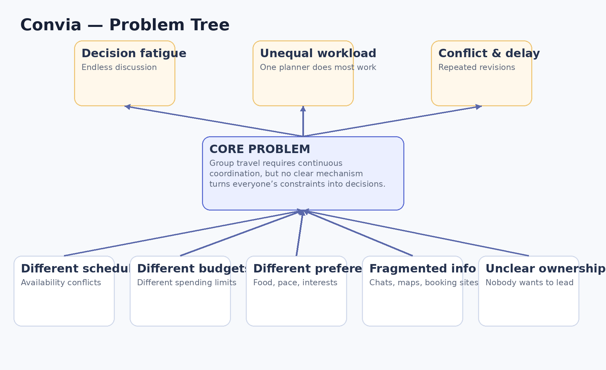
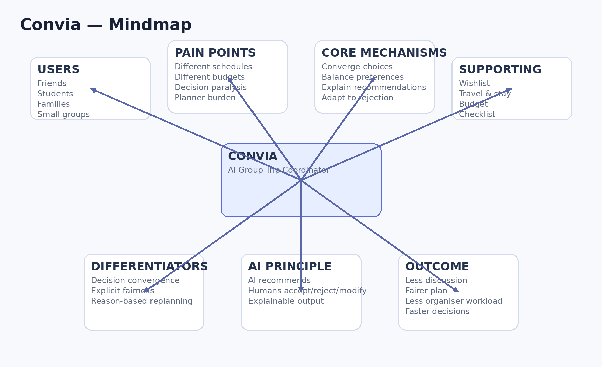
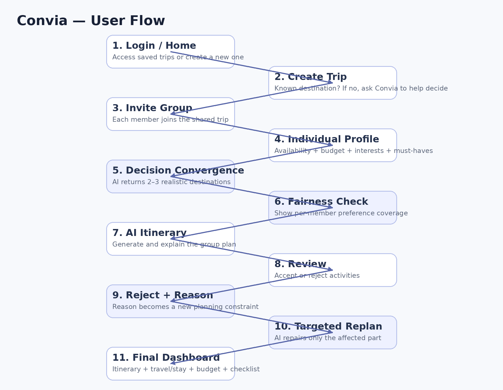
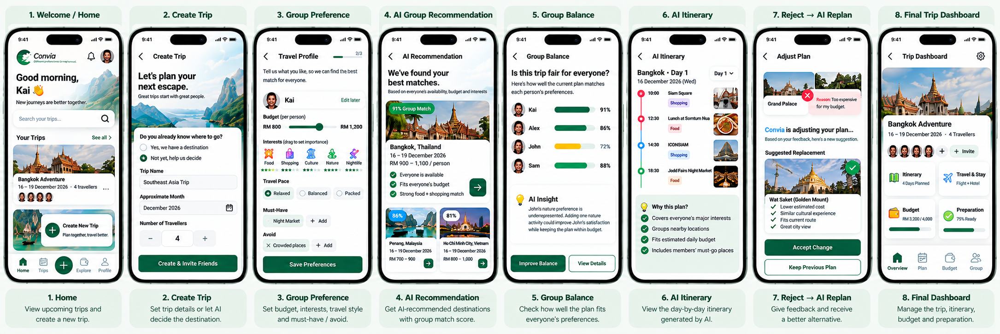
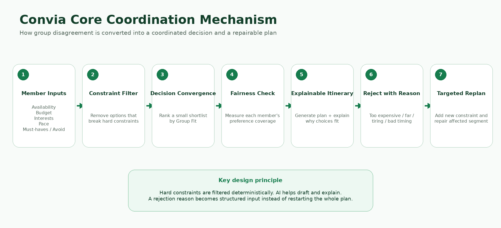
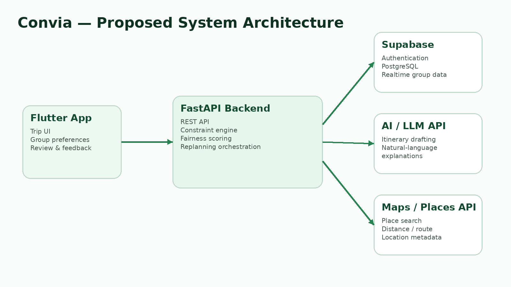
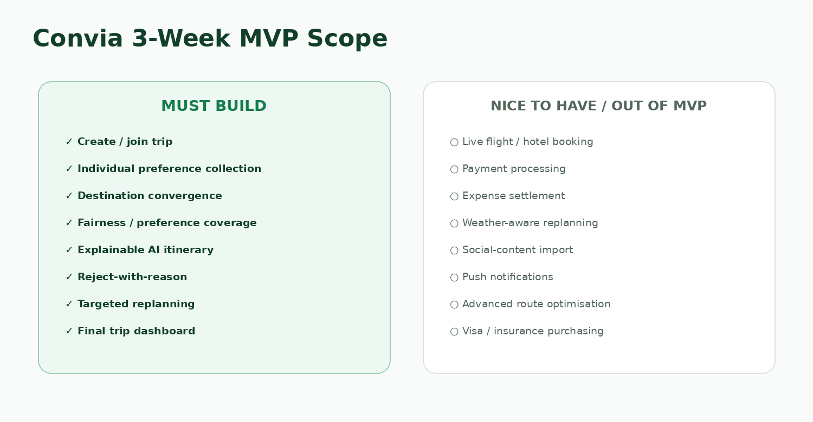

# Convia by [Team Name]

**Team:** [Member 1], [Member 2], [Member 3], [Member 4]  
**Problem Statement:** Travel Planner  
**Video Presentation:** [Unlisted YouTube Link]  
**Presentation Slides:** [Public Link]  
**UI Prototype:** [Public Prototype Link]

> **Convia — Different preferences. One way forward.**

---

# 1. Project Overview

## The Problem

Planning a group trip becomes difficult when several people need to agree on the same destination, dates, budget and itinerary. Different schedules, spending limits, interests and travel styles can create repeated discussion and decision fatigue. The coordination work also tends to fall on one organiser, who has to collect preferences, compare options and repeatedly revise the plan whenever someone disagrees.

The main stakeholders are **small groups of friends, students, families and casual travel groups**. Within these groups, the trip organiser experiences the highest coordination workload, while the other travellers still need their individual constraints and preferences to be represented fairly.

Existing travel apps solve important parts of the planning process, but they do not make Convia unnecessary:

- **Wanderlog** supports real-time collaboration, AI assistance, itinerary planning, route optimisation, reservation management, budgeting, expense splitting and checklists. Its strength is giving travellers a shared planning workspace and broad travel-management tools.
- **Mindtrip** provides personalised AI recommendations and itineraries, group collaboration, group chat, likes/comments and suggestions designed to work for a travelling group.
- **TripIt** is especially strong after bookings have been made: travellers forward confirmation emails and TripIt automatically organises flights, hotels, cars and other reservations into a comprehensive itinerary.

Because these products already cover AI itinerary generation and collaboration, Convia focuses on a narrower gap: **helping a group reach and repair shared decisions when members have conflicting constraints**.

## Our Solution

**Convia** is an AI-powered group travel coordinator that helps a group move from discussion to a shared, actionable plan. Each traveller independently provides availability, budget, interests, travel pace, must-have activities and avoidances. Convia combines these constraints, reduces the number of realistic choices, explains why an option fits the group and checks whether each member is represented fairly.

When someone disagrees with part of the itinerary, Convia asks **why**. That reason becomes a new planning constraint, allowing the system to propose a targeted replacement instead of forcing the organiser to manually rebuild the trip.

### Core Feature Set

1. **Group Trip Creation & Invitation** — create a shared trip and invite travel companions.
2. **Individual Travel Profiles** — collect each member's dates, budget, interests, pace, must-haves and avoidances.
3. **AI Decision Convergence** — reduce many possible destinations into a small shortlist that satisfies the group's combined constraints.
4. **Group Balance View** — show how well the current plan represents each member's preferences.
5. **Explainable AI Itinerary** — generate a practical itinerary and show why activities were chosen.
6. **Reject-with-Reason** — capture why an activity does not work, such as cost, distance, timing or effort.
7. **Constraint-Aware Replanning** — use the rejection reason to repair the affected part of the itinerary.
8. **Trip Dashboard** — bring together itinerary, travel & stay, budget, preparation and group status.

### Expected User Impact

Convia aims to reduce the coordination burden before a group trip. Instead of one organiser repeatedly collecting opinions and rebuilding the plan, every traveller contributes structured preferences once. The group then receives a small set of feasible choices, can see whether anyone is underrepresented, and can repair disagreements without restarting the entire itinerary.

The intended outcome is a planning process with **fewer open-ended decisions, less repeated organiser work, clearer reasons behind recommendations and more visible representation of each traveller's needs**.

### Supporting / Future Features

- Shared wishlist
- Flight and accommodation recommendations
- External booking links
- Shared expense tracking
- Pre-trip checklist
- Weather-aware replanning
- Travel-content import

---

# 2. Ideation & Process

## 2.1 Ideas We Considered

| Idea | Decision | Why it was kept / dropped |
|---|---|---|
| **AI Group Trip Coordinator** | **Chosen** | Directly addresses the workload created by coordinating schedules, budgets, preferences and disagreements. |
| **Group Decision Engine** | **Merged into Convia** | Became the Decision Convergence mechanism that narrows many possibilities into a few realistic group choices. |
| **Fairness-Aware Planning** | **Merged into Convia** | Prevents the plan from representing only the loudest or majority preference by making individual coverage visible. |
| **Reason-Based Replanning** | **Merged into Convia** | Converts disagreement into useful planning data and reduces repeated manual replanning. |
| Saved Posts → Itinerary | Future | Useful, but content-import functionality already exists in current travel products and is not the strongest differentiator. |
| Standard AI Itinerary Generator | Dropped as core | AI itinerary generation is already available in existing travel apps. |
| Expense-Focused Travel Planner | Dropped as core | Budgeting and expense splitting are useful but already well-established features in existing solutions. |
| Fully Automated “AI Group Leader” | Dropped | Gives AI too much control. Convia should recommend and coordinate while users retain final approval. |
| Full In-App Flight / Hotel Booking | Dropped from MVP | Payment, ticketing, cancellation and live inventory would make the three-week scope unnecessarily risky. Recommendation and external booking are sufficient for the MVP. |

## 2.2 Ideation Boards

### Problem Tree

*Figure 1. Problem Tree — root causes, central problem and effects of group travel coordination.*

The problem tree traces the core coordination problem back to different schedules, budgets, preferences, fragmented information and unclear planning ownership. It also shows the resulting decision fatigue, delays and unequal planning workload.

### Mindmap

*Figure 2. Ideation Mindmap — users, pain points, candidate features and the evolution toward Convia's final concept.*

The mindmap connects the target users, pain points, core mechanisms, supporting features and intended outcomes. It shows how the final concept moved away from a generic travel planner and toward group decision coordination.

### User Flow

*Figure 3. User Flow — the proposed end-to-end interaction from trip creation to targeted replanning.*

The user flow shows the end-to-end journey from trip creation and individual preference collection to destination convergence, fairness checking, itinerary generation, rejection, targeted replanning and final trip preparation.

## 2.3 Mentor Consultation

> **Important:** This section should contain only real mentor feedback. It is intentionally left as a placeholder until consultation takes place.

| Date | Mentor | Feedback Received | What Was Changed |
|---|---|---|---|
| [Date] | [Mentor Name] | [Actual feedback] | [Actual change, or explain why the team kept the original decision] |

---

# 3. Design & Prototype

## UI Prototype

**Public Prototype Link:** [Insert public Canva / Figma / Netlify / Vercel link]

> Before submission, open the link in an **incognito/private window** and confirm that reviewers can access it without requesting permission.

## Prototype Overview

*Figure 4. Convia prototype — eight key screens showing the complete group-planning interaction.*

The prototype follows one continuous story from group setup to a final coordinated trip. The green-and-white design language, rounded cards, travel imagery, hierarchy and controls are kept consistent across the eight key screens.

### Screen 1 — Welcome / Home
Shows the user's upcoming trips and the main **Create New Trip** action. This gives users a simple entry point into Convia.

### Screen 2 — Create Trip
The organiser creates a trip and chooses whether the destination is already known. If the group has not decided, Convia becomes part of the decision process from the beginning.

### Screen 3 — Group Preference
Each traveller independently enters budget, interests, travel style, must-haves and avoidances. This converts informal group-chat opinions into structured planning constraints.

### Screen 4 — AI Group Recommendation
Convia combines the group's constraints and presents a small shortlist of realistic destinations with a **Group Match** score and clear reasons. This demonstrates **Decision Convergence**.

### Screen 5 — Group Balance
Shows how well the current plan represents each traveller. An underrepresented member is flagged and Convia explains how the plan could be improved. This demonstrates **Explicit Fairness**.

### Screen 6 — AI Itinerary
Displays the generated day-by-day itinerary and a **Why this plan?** explanation covering interests, route efficiency, budget and must-go activities.

### Screen 7 — Reject → AI Replan
A traveller rejects an activity because it is too expensive. Convia records the reason, treats it as a new constraint and proposes a targeted lower-cost replacement. This demonstrates **Reason-Based Replanning**.

### Screen 8 — Final Trip Dashboard
Brings together the confirmed itinerary, travel & stay, budget, preparation progress and group status.

### Main Prototype Flow

**Home → Create Trip → Group Preferences → AI Destination Convergence → Group Balance → AI Itinerary → Reject with Reason → Targeted Replanning → Final Trip Dashboard**

### Core Coordination Mechanism

*Figure 5. Convia's core mechanism — member constraints are filtered and scored, fairness is checked explicitly, and rejection reasons become new constraints for targeted repair.*

This diagram is not an extra feature. It summarises the logic demonstrated by Screens 3–7 and makes the relationship between **Decision Convergence**, **Explicit Fairness** and **Reason-Based Replanning** clear to reviewers.

---

# 4. What Makes It Different

Convia does **not** claim that AI itinerary generation, collaboration, budgeting or reservation management are new. Existing products already provide many of these capabilities. The originality is in how Convia structures **group decision coordination**.

## 4.1 Decision Convergence

Typical recommendation systems can create more options for a group to debate. Convia instead combines hard constraints such as availability and budget with softer preferences such as interests and pace, then returns only a small number of realistic choices.

**Twist:** AI is used to **reduce the number of decisions** the group must make.

## 4.2 Explicit Fairness

A group plan can satisfy the majority while repeatedly ignoring one quieter member. Convia therefore exposes a per-member preference coverage score and flags underrepresented travellers.

**Twist:** Group planning is evaluated not only by overall popularity, but also by whether individual members are being represented.

## 4.3 Reason-Based Replanning

A rejection such as “I don't want this activity” normally creates more discussion for the organiser. In Convia, the user selects a concrete reason such as **too expensive, too far, too tiring or bad timing**.

**Twist:** The disagreement becomes a new constraint that the system can act on.

## 4.4 Targeted Plan Repair

Instead of regenerating the entire itinerary after every objection, Convia attempts to replace only the affected activity while preserving the group's other accepted decisions.

**Twist:** Replanning is treated as a local repair problem, reducing disruption and repeated work.

## 4.5 Explainable Group Recommendations

Destination and itinerary recommendations show why they fit: availability overlap, budget fit, preference overlap, must-have coverage and route considerations.

**Twist:** Members can understand why the group received a recommendation and can challenge it with a specific reason.

## Comparison with Existing Solutions

| Capability | TripIt | Wanderlog | Mindtrip | **Convia** |
|---|---|---|---|---|
| Organise an itinerary | ✓ | ✓ | ✓ | ✓ |
| AI itinerary / recommendations | Not its core positioning | ✓ | ✓ | ✓ |
| Group collaboration / sharing | ✓ Sharing | ✓ Real-time collaboration | ✓ Collaboration + group chat | ✓ |
| Budget / expense tools | Not core | ✓ | Not core | Supporting |
| Flight / hotel integration | ✓ Organises reservations | ✓ | ✓ | Recommendation / external booking in MVP |
| Structured input from every member as coordination constraints | Not core | Not core | Preferences and group collaboration | **Core** |
| Narrow many group constraints into a few explicit decision candidates | Not core | Not core | AI recommendations | **Core workflow** |
| Explicit per-member preference coverage / underrepresentation flag | Not core | Not core | Group-balancing suggestions exist | **Core UI mechanism** |
| Rejection reason becomes a new planning constraint | Not core | Not core | Not a core advertised interaction | **Core** |
| Targeted repair of the affected itinerary section | Not core | Route / AI editing tools exist | Customisable AI planning exists | **Core workflow** |

> The comparison intentionally avoids claiming that competitors “cannot” perform related actions. It focuses on what each product publicly positions as a core workflow and on the specific interaction Convia proposes.

---

# 5. Technical Architecture & Feasibility

## 5.1 Proposed Tech Stack

### Frontend — Flutter
Flutter provides a single mobile codebase and is suitable for building the prototype's card-based, interactive screens quickly. An Android-first build would keep the three-week implementation scope manageable.

**Expected constraint:** the team must avoid spending too much time polishing platform-specific UI before the core coordination logic is stable.

### Backend — FastAPI (Python)
FastAPI is lightweight and works naturally with Python-based scoring, constraint handling and AI integration.

**Expected constraint:** API keys and third-party services must remain on the backend rather than being exposed directly in the mobile app.

### Database & Authentication — Supabase
Supabase provides PostgreSQL, authentication and realtime capabilities that fit shared group-trip data.

**Expected constraint:** the prototype should stay within available free-tier quotas, and security policies must prevent one trip from exposing another group's data.

### AI Layer — LLM API + Deterministic Coordination Logic
The LLM is used for itinerary drafting and natural-language explanations. Hard constraints and fairness calculations are handled separately using deterministic logic.

This separation is important: **dates, budgets and fairness should not depend only on free-form AI output.**

### Maps / Places — Google Maps Platform or Equivalent
Used for place search, location metadata, distance and route information.

**Expected constraint:** API quota and billing requirements may limit how much live map functionality is demonstrated during the build phase.

### Flights & Accommodation
For the MVP, Convia will use recommendation data and external booking links rather than processing bookings itself.

If time and suitable API access are available, live search can be explored as an enhancement.

### Hosting
- **Backend:** Render, Railway or equivalent
- **Database/Auth:** Supabase
- **Prototype / Web showcase:** Canva, Figma, Netlify or Vercel
- **Mobile build:** Android APK for demo if the implementation reaches that stage

## 5.2 System Architecture

*Figure 6. Proposed system architecture — Flutter client, FastAPI coordination layer, Supabase, AI service and Maps/Places service.*

### Proposed Data Flow

1. Travellers submit trip constraints through the Flutter app.
2. FastAPI validates and stores trip/member data in Supabase.
3. A deterministic coordination layer filters impossible choices using dates and budgets.
4. Remaining choices are scored using group preference coverage and fairness.
5. Maps/Places data helps evaluate locations and routes.
6. The LLM generates readable explanations and itinerary drafts using the filtered/scored options.
7. When a user rejects an activity, the reason is stored as a new constraint.
8. The backend searches for a replacement and updates only the affected itinerary segment where possible.

## 5.3 Proposed Coordination Logic

Convia separates **hard constraints** from **soft preferences** so the system remains explainable and feasible to implement.

**Hard constraints** are checked first:
- dates must overlap;
- estimated cost must stay within the group's accepted budget range;
- explicitly avoided options are excluded.

Only feasible options continue to ranking. The MVP then calculates a configurable **Group Fit** score from preference overlap, must-have coverage and route practicality. The exact weights will be tuned during testing rather than presented as fixed values before implementation.

For fairness, Convia also calculates **Member Coverage**: how many of each traveller's weighted preferences are represented by the current plan. If one member is substantially below the others, the Group Balance screen flags the issue and suggests a change.

When an activity is rejected, the selected reason is converted into a new constraint. For example, **Too expensive** lowers the acceptable cost for the replacement activity. Convia then searches for a replacement that satisfies the new constraint while preserving as much of the accepted itinerary as possible.

This logic deliberately keeps critical constraints deterministic and uses the AI layer mainly for itinerary drafting and human-readable explanations.

## 5.4 Build Plan & Scope — 3 Weeks

### Week 1 — Group Setup & Decision Convergence
- Authentication
- Create / join trip
- Member preference profiles
- Shared trip data model
- Availability and budget filtering
- Basic destination scoring
- AI recommendation screen

**Week 1 milestone:** four users can join one trip, submit constraints and receive a ranked destination shortlist.

### Week 2 — Itinerary & Fairness
- Wishlist / must-have activities
- Itinerary generation
- Preference coverage calculation
- Group Balance screen
- Explainable recommendation text
- Review / accept interactions
- Basic map/place integration

**Week 2 milestone:** the selected destination produces an explainable itinerary with visible member coverage.

### Week 3 — Replanning, Integration & Demo
- Reject-with-reason flow
- Constraint-aware targeted replanning
- Final dashboard
- Budget summary
- Preparation checklist
- End-to-end testing
- Deployment / APK preparation
- Demo-data fallback for unreliable third-party APIs

**Week 3 milestone:** the full prototype story works end to end: **preferences → convergence → fairness → itinerary → rejection → targeted repair**.

## 5.5 MVP Scope

### Must Build
- Create / join trip
- Individual preference collection
- Destination convergence
- Basic fairness / preference coverage
- Explainable AI itinerary
- Reject-with-reason
- Targeted replanning
- Final trip dashboard

### Nice to Have
- Live flight / hotel search
- Expense settlement
- Weather-aware replanning
- Social-media / screenshot import
- Push notifications
- Advanced route optimisation

### Visual Scope Boundary

*Figure 7. Three-week MVP scope — the build focuses on proving Convia's group-coordination mechanism rather than recreating a full online travel agency.*

### Explicitly Out of Scope for MVP
- In-app payment processing
- Issuing flight tickets
- Acting as a hotel booking merchant
- Full visa processing
- Full travel-insurance purchasing
- Large-group / enterprise travel management

Keeping these features outside the MVP is intentional. The goal of the three-week build is to prove Convia's **group coordination mechanism**, not to recreate an entire online travel agency.

---

# Submission Requirement Audit

This README is intentionally organised in the same five-section order as the official submission template:

| Official requirement | Where it is addressed |
|---|---|
| Project problem, causes, stakeholders, similar apps and shortcomings | Section 1 |
| Solution in 3–4 sentences + feature set | Section 1 |
| Every distinct idea with kept/dropped reasoning | Section 2.1 |
| Ideation boards + 1–2 line explanations | Section 2.2, Figures 1–3 |
| Mentor consultation: date, mentor, feedback, change | Section 2.3 — placeholder until real consultation |
| Public UI prototype link | Section 3 — placeholder until public link is supplied |
| 4–8 key screens + interaction captions | Section 3, Figure 4 + eight screen explanations |
| Novel features / twist | Section 4 |
| Optional competitor comparison | Section 4 |
| Frontend, backend, database, APIs/services, hosting + rationale/constraints | Section 5.1 |
| Optional architecture diagram | Section 5.2, Figure 6 |
| Explicit 3-week build plan and narrow scope | Sections 5.4–5.5, Figure 7 |

# Final Pre-Submission Checklist

- [ ] Replace **[Team Name]** and member placeholders.
- [ ] Add the **unlisted YouTube** presentation link.
- [ ] Add the **public presentation slides** link.
- [ ] Add the **public prototype** link.
- [ ] Test prototype and slide links in an incognito/private window.
- [ ] Add only **real mentor consultation** details.
- [ ] Confirm the prototype image and all ideation images render correctly on GitHub.
- [ ] Keep the presentation video between **3–5 minutes**.
- [ ] Ensure the video title uses the required team-name format.
