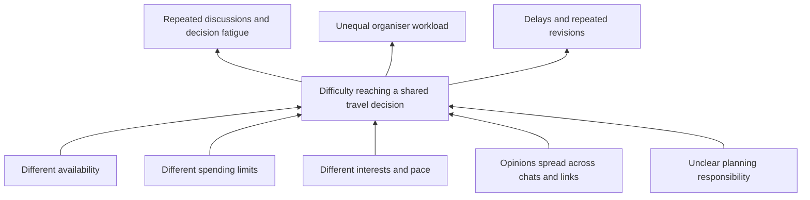
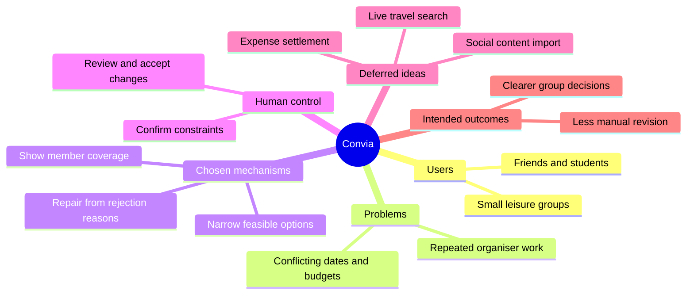
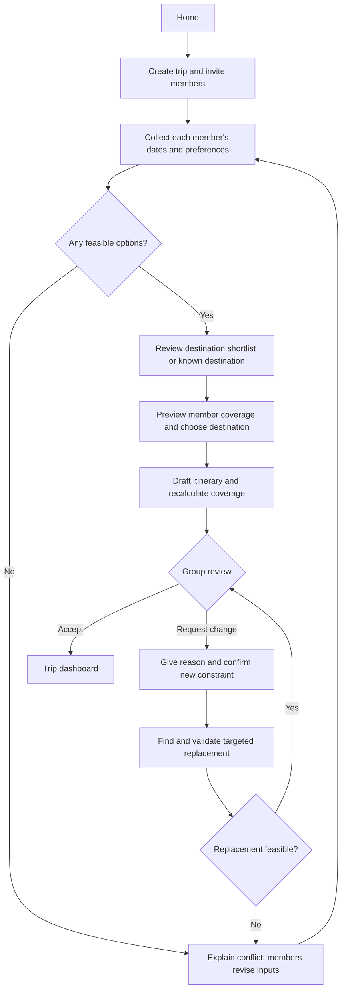
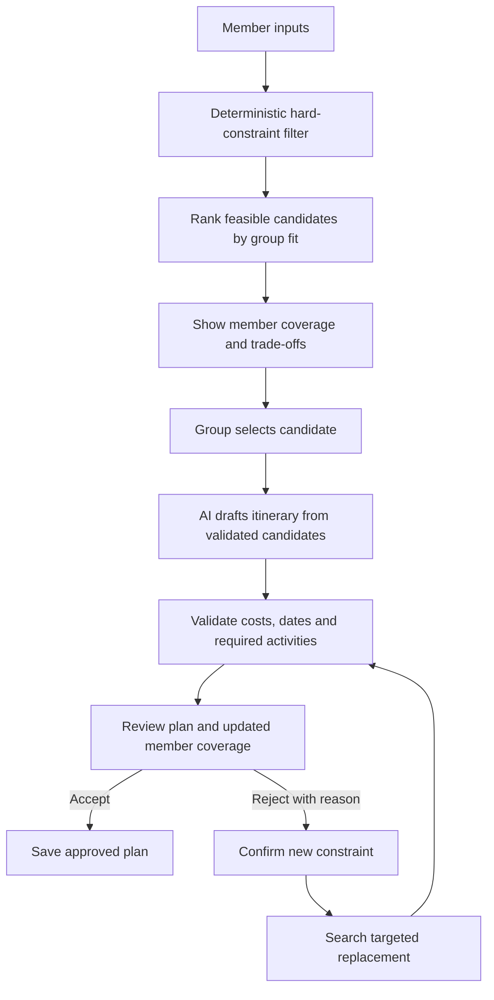
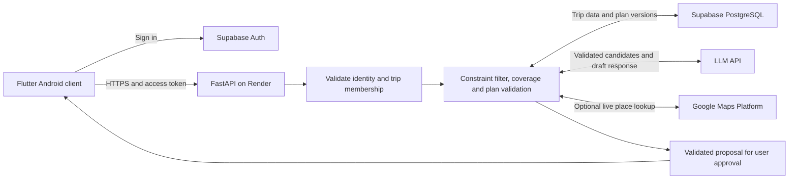
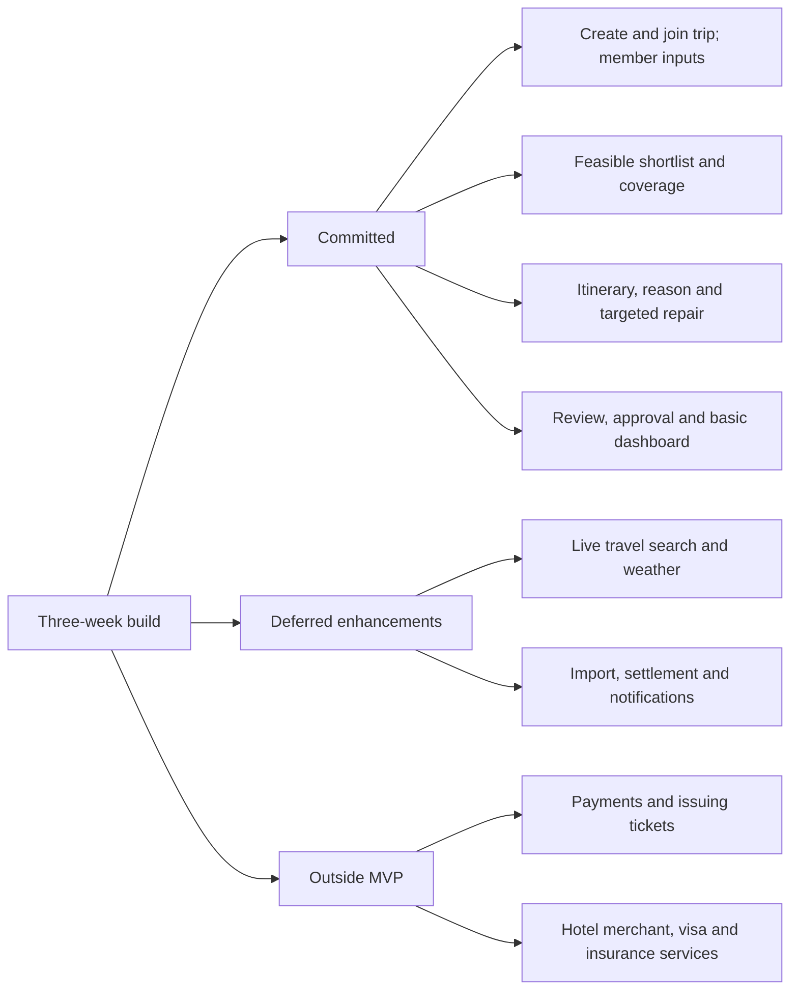

# Convia by C0507

**Team:** Ng Hai Zhu, Antonio Yau Zhi Chen, Yee Chao Tong, Tang Xiang Xian  

**Problem Statement:** Travel Planner  
**Video Presentation:** [Watch the presentation on YouTube](https://youtu.be/mAzEN54wRr0)  
**Presentation Slides:** [View the presentation slides on Canva](https://canva.link/you02nvnbfpogia)  
**UI Prototype:** [View UI prototype](https://canva.link/27grrzfdakugp9t)

> **Convia — Different preferences. One way forward.**

---

# 1. Project Overview

## The Problem

Planning a group trip becomes difficult when several people need to agree on the same destination, dates, budget and itinerary. Different schedules, spending limits, interests and travel styles can create repeated discussion and decision fatigue. The coordination work also tends to fall on one organiser, who has to collect preferences, compare options and repeatedly revise the plan whenever someone disagrees.

The initial target users are **small groups of friends and students planning a leisure trip**; families and other casual travel groups are potential later users. Within these groups, the trip organiser experiences the highest coordination workload, while the other travellers still need their individual constraints and preferences to be represented fairly.

Existing tools address parts of this problem:

| Product | Existing strength | Gap Convia investigates |
|---|---|---|
| [Wanderlog](https://wanderlog.com/) | Shared itineraries, collaboration and budget tools. | A shared workspace still leaves the group needing a clear procedure to resolve conflicting individual constraints. |
| [Mindtrip](https://mindtrip.ai/) | AI travel recommendations and collaborative planning. | Convia proposes making individual preference coverage and reason-to-constraint repair explicit in the review flow. |
| [TripIt](https://www.tripit.com/web) | Turns booking confirmations into an organised itinerary. | Our focus begins earlier, when the group has not agreed on what to book. |

These gaps describe our design focus, inferred from the products' published positioning; they are not claims that competitors lack every related capability. Convia's hypothesis is that structured inputs, visible member coverage and targeted repair can reduce organiser effort.

## Our Solution

The UI prototype presents the proposed experience, with implementation planned for the three-week building phase.

**Convia** is a proposed AI-assisted group travel coordinator that helps a group move from discussion to a shared, actionable plan. Each traveller independently provides availability, budget, interests, travel pace, must-have activities and avoidances. Convia combines these constraints, reduces the number of realistic choices, explains why an option fits the group and checks whether each member is represented fairly.

When someone disagrees with part of the itinerary, Convia asks **why**. That reason becomes a new planning constraint, allowing the system to propose a targeted replacement instead of forcing the organiser to manually rebuild the trip.

### Core Feature Set

1. **Group Trip Creation & Invitation** — create a shared trip and invite travel companions.
2. **Individual Travel Profiles** — collect each member's dates, budget, interests, pace, must-haves and avoidances.
3. **AI Decision Convergence** — reduce many possible destinations into a small shortlist that satisfies the group's combined constraints.
4. **Group Balance View** — show how well the current plan represents each member's preferences.
5. **Explainable AI Itinerary** — generate a practical itinerary and show why activities were chosen.
6. **Reject-with-Reason** — capture why an activity does not work, such as cost, distance, timing or effort.
7. **Constraint-Aware Replanning** — use the rejection reason to repair the affected part of the itinerary.
8. **Trip Dashboard** — bring together itinerary, travel & stay, budget, preparation and group status.

### Expected User Impact

Convia aims to reduce the coordination burden before a group trip. Instead of one organiser repeatedly collecting opinions and rebuilding the plan, every traveller contributes structured preferences once. The group then receives a small set of feasible choices, can see whether anyone is underrepresented, and can repair disagreements without restarting the entire itinerary.

The intended outcome is a planning process with **fewer open-ended decisions, less repeated organiser work, clearer reasons behind recommendations and more visible representation of each traveller's needs**.

### Supporting / Future Features

- Shared wishlist
- Flight and accommodation recommendations
- External booking links
- Shared expense tracking
- Pre-trip checklist
- Weather-aware replanning
- Travel-content import

---

# 2. Ideation & Process

## 2.1 Ideas We Considered

| Idea | Decision | Why it was kept / dropped |
|---|---|---|
| **AI Group Trip Coordinator** | **Chosen** | Directly addresses the workload created by coordinating schedules, budgets, preferences and disagreements. |
| **Group Decision Engine** | **Merged into Convia** | Became the Decision Convergence mechanism that narrows many possibilities into a few realistic group choices. |
| **Fairness-Aware Planning** | **Merged into Convia** | Reduces the risk of a plan representing only the loudest or majority preference by making individual coverage visible. |
| **Reason-Based Replanning** | **Merged into Convia** | Converts disagreement into useful planning data and reduces repeated manual replanning. |
| Saved Posts → Itinerary | Future | Useful, but content-import functionality already exists in current travel products and is not the strongest differentiator. |
| Standard AI Itinerary Generator | Dropped as core | AI itinerary generation is already available in existing travel apps. |
| Expense-Focused Travel Planner | Dropped as core | Budgeting and expense splitting are useful but already well-established features in existing solutions. |
| Fully Automated “AI Group Leader” | Dropped | Gives AI too much control. Convia should recommend and coordinate while users retain final approval. |
| Full In-App Flight / Hotel Booking | Dropped from MVP | Payment, ticketing, cancellation and live inventory would make the three-week scope unnecessarily risky. Manual travel notes and external links are sufficient for the MVP. |

## 2.2 Ideation Boards

### Problem Tree

*Figure 1. Problem Tree — root causes, central problem and effects of group travel coordination.*

The problem tree traces the core coordination problem back to different schedules, budgets, preferences, fragmented information and unclear planning ownership. It also shows the resulting decision fatigue, delays and unequal planning workload.

### Mindmap

*Figure 2. Ideation Mindmap — users, pain points, candidate features and the evolution toward Convia's proposed concept.*

The mindmap connects the target users, pain points, core mechanisms, supporting features and intended outcomes. It shows how the proposed concept moved away from a generic travel planner and toward group decision coordination.

### User Flow

*Figure 3. User Flow — the proposed end-to-end interaction from trip creation to targeted replanning.*

The user flow shows the end-to-end journey from trip creation and individual preference collection to destination convergence, fairness checking, itinerary generation, rejection, targeted replanning and final trip preparation.

## 2.3 Mentor Consultation

**Consultation date: 12 September 2026**  
**Mentor: Mah Qing Fung**

| Feedback Received | What Was Changed |
|---|---|
| Discussed the role of AI in Convia and the need to implement the proposed AI Assistant within the application, rather than leave it as a concept. | Clarified the AI Assistant's proposed responsibilities in destination recommendations, itinerary drafting, explanations and targeted replanning, alongside deterministic constraint validation and user approval. |
| The mentor emphasised defining the complete application flow: how users begin, how the main features and AI-assisted processes support the planning journey, and what outcome users receive. | Reorganised the end-to-end workflow from trip creation and member preference collection through destination convergence, group balance, itinerary generation, reason-based feedback and targeted replanning to the trip dashboard. Clarified the sequence and responsibilities of the major features. |

These changes refine the workflow and proposed implementation responsibilities for the building phase.

---

# 3. Design & Prototype

## UI Prototype

**UI Prototype:** [View the eight ordered UI screens](https://canva.link/27grrzfdakugp9t). Interaction captions follow below.

The prototype is a static UI walkthrough. Names, scores, prices and progress values are illustrative, not measured outcomes or live quotes.

## Prototype Overview

*Figure 4. Convia prototype — eight key screens showing the complete group-planning interaction.*

The prototype illustrates the journey from group setup to an approved trip, including a separate activity-replacement example. The green-and-white design language, rounded cards, travel imagery, hierarchy and controls are kept consistent across the eight key screens.

### Screen 1 — Welcome / Home
Shows the user's upcoming trips and the main **Create New Trip** action. This gives users a simple entry point into Convia.

### Screen 2 — Create Trip
The organiser creates a trip and chooses whether the destination is already known. If the group has not decided, Convia becomes part of the decision process from the beginning.

### Screen 3 — Group Preference
Each traveller independently enters budget, interests, travel style, must-haves and avoidances. This converts informal group-chat opinions into structured planning constraints.

### Screen 4 — AI Group Recommendation
Convia combines the group's constraints and presents a small shortlist of realistic destinations with a **Group Match** score and clear reasons. This demonstrates **Decision Convergence**.

### Screen 5 — Group Balance
Shows how well the current plan represents each traveller. An underrepresented member is flagged and Convia explains how the plan could be improved. This demonstrates **Explicit Fairness**.

### Screen 6 — AI Itinerary
Displays the generated day-by-day itinerary and a **Why this plan?** explanation covering interests, route efficiency, budget and must-go activities.

### Screen 7 — Reject → AI Replan
A traveller rejects an activity because it is too expensive. Convia records the reason, treats it as a new constraint and proposes a targeted lower-cost replacement. This demonstrates **Reason-Based Replanning**.

### Screen 8 — Trip Dashboard
Brings together the confirmed itinerary, travel & stay, budget, preparation progress and group status.

Screen 7 shows Grand Palace from a different itinerary segment than the Day 1 visible in Screen 6. Coverage and cost figures are illustrative; a working build must recalculate them from the validated plan. The Accept Change action confirms a proposal before applying it.

### Main Prototype Flow

**Home → Create Trip → Group Preferences → AI Destination Convergence → Group Balance → AI Itinerary → Reject with Reason → Targeted Replanning → Trip Dashboard**

### Core Coordination Mechanism

*Figure 5. Convia's core mechanism — member constraints are filtered and scored, fairness is checked explicitly, and rejection reasons become new constraints for targeted repair.*

The mechanism links Screens 3–7 through **Decision Convergence**, **Explicit Fairness** and **Reason-Based Replanning**.

---

# 4. What Makes It Different

Convia does **not** claim that AI itinerary generation, collaboration, budgeting or reservation management are new. Existing products already provide many of these capabilities. The originality is in how Convia structures **group decision coordination**.

## 4.1 Decision Convergence

Typical recommendation systems can create more options for a group to debate. Convia instead combines hard constraints such as availability and budget with softer preferences such as interests and pace, then returns only a small number of realistic choices.

**Twist:** AI is used to **reduce the number of decisions** the group must make.

## 4.2 Explicit Fairness

A group plan can satisfy the majority while repeatedly ignoring one quieter member. Convia therefore exposes a per-member preference coverage score and flags underrepresented travellers.

**Twist:** Group planning is evaluated not only by overall popularity, but also by whether individual members are being represented.

## 4.3 Reason-Based Replanning

A rejection such as “I don't want this activity” normally creates more discussion for the organiser. In Convia, the user selects a concrete reason such as **too expensive, too far, too tiring or bad timing**.

**Twist:** The disagreement becomes a new constraint that the system can act on.

## 4.4 Targeted Plan Repair

Instead of regenerating the entire itinerary after every objection, Convia attempts to replace only the affected activity while preserving the group's other accepted decisions.

**Twist:** Replanning is treated as a local repair problem, reducing disruption and repeated work.

## 4.5 Explainable Group Recommendations

Destination and itinerary recommendations show why they fit: availability overlap, budget fit, preference overlap, must-have coverage and route considerations.

**Twist:** Members can understand why the group received a recommendation and can challenge it with a specific reason.

# 5. Technical Architecture & Feasibility

## 5.1 Proposed Tech Stack

### Frontend — Flutter
Flutter provides a single mobile codebase and is suitable for building the prototype's card-based, interactive screens quickly. An Android-first build would keep the three-week implementation scope manageable.

**Expected constraint:** the team must avoid spending too much time polishing platform-specific UI before the core coordination logic is stable.

### Backend — FastAPI (Python)
FastAPI is lightweight and works naturally with Python-based scoring, constraint handling and AI integration.

**Expected constraint:** API keys and third-party services must remain on the backend rather than being exposed directly in the mobile app.

### Database & Authentication — Supabase
Supabase provides PostgreSQL, authentication and realtime capabilities that fit shared group-trip data.

**Expected constraint:** the prototype should stay within available free-tier quotas, and security policies must prevent one trip from exposing another group's data.

### AI Layer — LLM API + Deterministic Coordination Logic
An LLM API is proposed for itinerary drafting and natural-language explanations. API latency, cost and invalid output are expected constraints. The proposed integration uses schema validation, a bounded retry and a clearly labelled sample-data fallback. Hard constraints and fairness calculations are handled separately using deterministic logic.

This separation is important: **dates, budgets and fairness should not depend only on free-form AI output.**

### Maps / Places — Google Maps Platform (proposed integration)
Used for place search, location metadata, distance and route information.

**Expected constraint:** API quota and billing requirements may limit how much live map functionality is demonstrated during the build phase.

### Flights & Accommodation
The MVP will store manually entered travel/stay notes and external links. Live inventory and booking integration are outside the committed build.

If time and suitable API access are available, live search can be explored as an enhancement.

### Hosting
- **Backend:** Render (proposed), to deploy the FastAPI service; deployment limits, latency and costs are expected operational constraints.
- **Database/Auth:** Supabase
- **Prototype showcase:** Canva hosts the eight-page UI walkthrough; this repository also embeds the overview image.
- **Mobile build:** an Android APK is the planned demonstration deliverable.

## 5.2 System Architecture

*Figure 6. Proposed system architecture — Flutter client, FastAPI coordination layer, Supabase, AI service and Maps/Places service.*

### Proposed Data Flow

1. Travellers submit trip constraints through the Flutter app.
2. FastAPI validates and stores trip/member data in Supabase.
3. A deterministic coordination layer filters impossible choices using dates and budgets.
4. Remaining choices are scored using group preference coverage and fairness.
5. Maps/Places data helps evaluate locations and routes.
6. The LLM generates readable explanations and itinerary drafts using the filtered/scored options.
7. When a user rejects an activity, the reason is stored as a new constraint.
8. The backend searches for a replacement and updates only the affected itinerary segment where possible.

## 5.3 Proposed Coordination Logic

Convia separates **hard constraints** from **soft preferences** so the system remains explainable and feasible to implement.

**Hard constraints** are checked first:
- dates must overlap;
- estimated per-person cost must stay within each member's confirmed maximum budget, using a consistent currency and cost basis;
- explicitly avoided options are excluded;
- required must-haves must be satisfied or reported as infeasible.

If no option is feasible, show the conflicting requirements and ask members to revise their own inputs. Never silently relax a budget, avoidance or date constraint. Unknown costs are marked unverified.

Only feasible options continue to ranking. The MVP then calculates a configurable **Group Fit** score from preference overlap, must-have coverage and route practicality. The exact weights will be tuned during testing rather than presented as fixed values before implementation.

For fairness, the proposed **Member Coverage** is the sum of weights of matched soft preferences divided by the sum of submitted soft-preference weights, shown as a percentage. With no soft preferences, show “Not enough input” rather than 0%. It is an explainable coverage indicator, not a guarantee of satisfaction. The alert threshold will be tested; the prototype percentages are illustrative. Preview coverage uses a candidate activity set and is recalculated after itinerary generation and each proposed repair.

When an activity is rejected, the selected reason is converted into a new constraint. For example, **Too expensive** prompts the traveller to confirm a replacement spending cap. Convia then searches for a replacement that satisfies the new constraint while preserving as much of the accepted itinerary as possible.

Revalidate the replacement against all members' hard constraints and recalculate coverage. Show the proposed change for group review; preserve the previous version until accepted. If no replacement fits, explain the conflict. The backend checks trip membership on every read/write and detects stale plan versions to avoid overwriting another member's edit.

This logic deliberately keeps critical constraints deterministic and uses the AI layer mainly for itinerary drafting and human-readable explanations.

## 5.4 Build Plan & Scope — 3 Weeks

### Week 1 — Group Setup & Decision Convergence
- Authentication
- Create / join trip
- Member preference profiles
- Shared trip data model
- Availability and budget filtering
- Basic destination scoring
- AI recommendation screen

**Week 1 milestone:** four users can join one trip, submit constraints and receive a ranked destination shortlist.

### Week 2 — Itinerary & Fairness
- Must-have activities
- Itinerary generation
- Preference coverage calculation
- Group Balance screen
- Explainable recommendation text
- Review / accept interactions
- Basic map/place integration

**Week 2 milestone:** the selected destination produces an explainable itinerary with visible member coverage.

### Week 3 — Replanning, Integration & Demo
- Reject-with-reason flow
- Constraint-aware targeted replanning
- Trip dashboard
- Budget summary
- Basic preparation checklist if core flow is stable
- End-to-end testing
- Deployment / APK preparation
- Demo-data fallback for unreliable third-party APIs

**Week 3 milestone:** the full prototype story works end to end: **preferences → convergence → fairness → itinerary → rejection → targeted repair**.

### Planned Evaluation

The planned four-member evaluation covers no shared dates, a budget conflict, no preferences, an unavailable replacement and simultaneous edits. Acceptance criteria are no silent hard-constraint violations, user approval before applying a repair, and preservation of unaffected activities. A small user walkthrough will assess whether members understand the coverage score and whether organisers need fewer manual revisions; no improvement is claimed before measurement.

## 5.5 MVP Scope

### Planned MVP Features
- Create / join trip
- Individual preference collection
- Destination convergence
- Basic fairness / preference coverage
- Explainable AI itinerary
- Reject-with-reason
- Targeted replanning
- Trip dashboard

### Deferred Enhancements
- Live flight / hotel search (after the committed build)
- Expense settlement
- Weather-aware replanning
- Social-media / screenshot import
- Push notifications
- Advanced route optimisation

### Visual Scope Boundary

*Figure 7. Three-week MVP scope — the build focuses on proving Convia's group-coordination mechanism rather than recreating a full online travel agency.*

### Explicitly Out of Scope for MVP
- In-app payment processing
- Issuing flight tickets
- Acting as a hotel booking merchant
- Full visa processing
- Full travel-insurance purchasing
- Large-group / enterprise travel management

Keeping these features outside the MVP is intentional. The goal of the three-week build is to prove Convia's **group coordination mechanism**, not to recreate an entire online travel agency.

---
